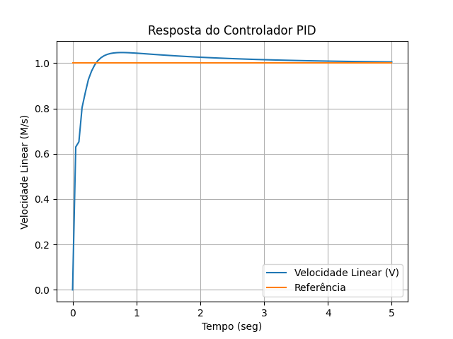
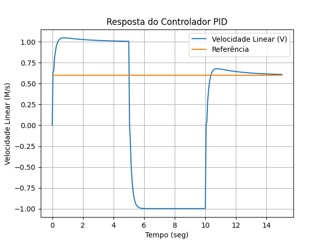

# Controlador PID para Simulação de Robô no Gazebo

Este projeto implementa um controlador PID para controlar a velocidade de um robô simulado no Gazebo usando o ROS.

<p align="center">
  
</p>

## O que é um Controlador PID?

Um controlador PID (Proporcional, Integral, Derivativo) é um mecanismo de controle usado em sistemas de controle industrial. Ele ajusta a saída de um processo para manter a variável de controle (por exemplo, a velocidade do robô) próxima do valor desejado (setpoint).

- **Proporcional (P)**: Corrige o erro atual.
- **Integral (I)**: Corrige o erro acumulado ao longo do tempo.
- **Derivativo (D)**: Reage à taxa de mudança do erro.

## Implementação do Código

O script em Python implementa um controlador PID que publica comandos de velocidade no tópico `/cmd_vel` do ROS.

### Estrutura do Código

- **Inicialização do Nó ROS**: O nó é inicializado e configurado para usar tempo simulado.
- **Leitura da Velocidade de Referência**: A velocidade desejada é obtida via entrada do usuário.
- **Loop de Controle**: 
  - Calcula o erro entre a velocidade atual e a desejada.
  - Calcula a integral e derivada do erro.
  - Aplica a fórmula PID para obter o sinal de controle.
  - Publica o comando de velocidade ajustado no tópico `/cmd_vel`.
- **Plotagem dos Resultados**: Gráficos da resposta do sistema são gerados para análise.

### Arquivo de Launch

Um arquivo de launch (`control.launch`) é usado para iniciar o Gazebo com um mundo vazio e o controlador PID.

## Resultados

### Resposta do Controlador PID

Os gráficos a seguir mostram a resposta do controlador PID em diferentes cenários de velocidade de referência.

<p align="center">
  
  
</p>

## Como Testar

### Pré-requisitos

- ROS (Robot Operating System) instalado.
- Gazebo instalado.
- Pacote `geometry_msgs` do ROS.
- `matplotlib` e `numpy` instalados para plotagem de gráficos.

### Passos para Testar

1. **Clone o Repositório**

   ```bash
   git clone https://github.com/seu_usuario/seu_repositorio.git
   cd seu_repositorio

2. **Compile o Workspace**
   Navegue até o workspace do ROS e compile os pacotes.
   
   ```bash
   cd ~/catkin_ws
   catkin_make
   source devel/setup.sh

3. **Execute o Arquivo Launch**
   Execute o arquivo control.launch para iniciar o Gazebo e o controlador PID.
      
   ```bash
   roslaunch seu_pacote control.launch

<p align="center">
  <video width="80%" controls>
    <source src="docs/resultvid.webm" type="video/webm">
    Seu navegador não suporta a tag de vídeo.
  </video>
</p>
